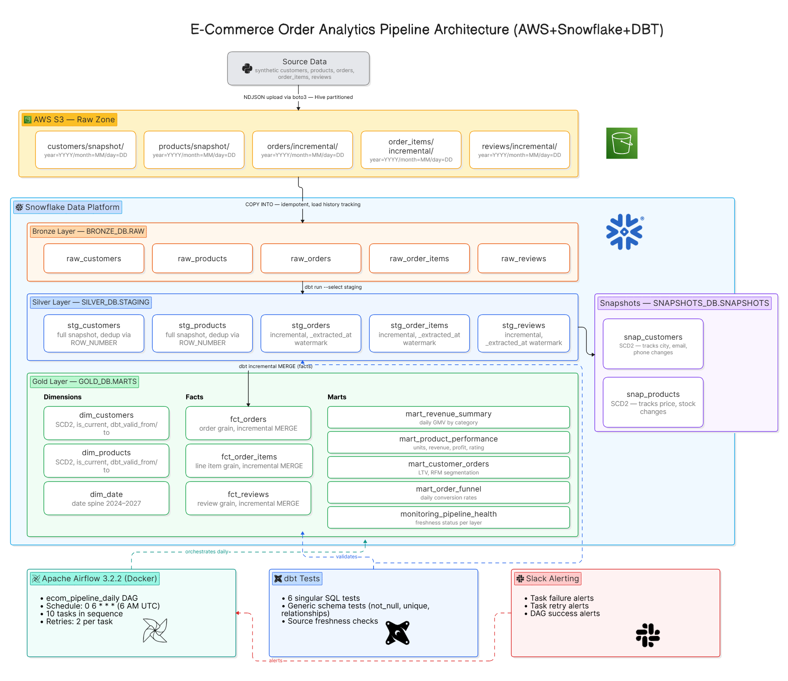

# E-Commerce Order Analytics Pipeline

End-to-end data engineering pipeline built on Medallion Architecture using AWS S3, Snowflake, dbt Core, and Apache Airflow. Demonstrates incremental loading, SCD Type 2, dimensional modelling, data quality testing, and Slack alerting.

---

## Architecture Overview


```
┌─────────────────────────────────────────────────────────┐
│                    DATA SOURCES                         │
│         Python synthetic data generator                 │
│   (customers, products, orders, order_items, reviews)   │
└─────────────────────┬───────────────────────────────────┘
                      │ 
                      ▼
┌─────────────────────────────────────────────────────────┐
│                  AWS S3 — RAW ZONE                      │
│                                                         │
│  customers/snapshot/year=YYYY/month=MM/day=DD/          │
│  products/snapshot/year=YYYY/month=MM/day=DD/           │
│  orders/incremental/year=YYYY/month=MM/day=DD/          │
│  order_items/incremental/year=YYYY/month=MM/day=DD/     │
│  reviews/incremental/year=YYYY/month=MM/day=DD/         │
│                                                         │
│  Format: NDJSON — one JSON object per line              │
│  Partitioning: Hive-style (year/month/day)              │
└─────────────────────┬───────────────────────────────────┘
                      │ Snowflake COPY INTO (idempotent)
                      ▼
┌─────────────────────────────────────────────────────────┐
│            BRONZE LAYER — BRONZE_DB.RAW                 │
│                                                         │
│  raw_customers   raw_products   raw_orders              │
│  raw_order_items               raw_reviews              │
│                                                         │
│  • Raw NDJSON parsed and typed via COPY INTO            │
│  • _extracted_at metadata column added                  │
│  • Snowflake load history prevents duplicate loads      │
│  • FORCE=TRUE available for manual reloads              │
└─────────────────────┬───────────────────────────────────┘
                      │ dbt run --select staging
                      ▼
┌─────────────────────────────────────────────────────────┐
│          SILVER LAYER — SILVER_DB.STAGING               │
│                                                         │
│  stg_customers   stg_products   stg_orders              │
│  stg_order_items               stg_reviews              │
│                                                         │
│  • Cast, rename, clean, normalise columns               │
│  • ROW_NUMBER() deduplication within each batch         │
│  • _extracted_at watermark filters new records only     │
│  • dbt incremental materialization with unique_key      │
│    → dbt generates MERGE SQL internally                 │
│  • stg_customers / stg_products: full snapshot view     │
│    (latest row per ID wins via ROW_NUMBER)              │
└──────────┬──────────────────────────┬───────────────────┘
           │ dbt snapshot             │ dbt run --select marts
           ▼                          ▼
┌─────────────────────┐   ┌──────────────────────────────────────────┐
│  SNAPSHOTS_DB       │   │       GOLD LAYER — GOLD_DB.MARTS         │
│  .SNAPSHOTS         │   │                                          │
│                     │   │  Dimensions                              │
│  snap_customers     │──▶│  dim_customers  (SCD2 from snapshot)     │
│  snap_products      │──▶│  dim_products   (SCD2 from snapshot)     │
│                     │   │  dim_date       (date spine 2024–2027)   │
│  • strategy: check  │   │                                          │
│  • dbt_valid_from   │   │  Facts                                   │
│  • dbt_valid_to     │   │  fct_orders      (incremental)           │
│  • dbt_scd_id       │   │  fct_order_items (incremental)           │
│  • is_current flag  │   │  fct_reviews     (incremental)           │
└─────────────────────┘   │                                          │
                          │  Marts                                   │
                          │  mart_revenue_summary                    │
                          │  mart_product_performance                │
                          │  mart_customer_orders (RFM)              │
                          │  mart_order_funnel                       │
                          │  monitoring_pipeline_health              │
                          └──────────────────────────────────────────┘

┌─────────────────────────────────────────────────────────┐
│              ORCHESTRATION & OBSERVABILITY              │
│                                                         │
│  Airflow 3.2.2 (Docker)                                 │
│  └── ecom_pipeline_daily DAG — 0 6 * * *                │
│                                                         │
│  dbt Tests                                              │
│  └── 6 singular tests + generic schema tests            │
│                                                         │
│  Slack Alerts                                           │
│  └── task failure / retry / DAG success                 │
└─────────────────────────────────────────────────────────┘
```

---

## How Data Flows Daily

**Day 1 — Full base load:**
- 5,000 customers and 500 products generated with fixed seed (`random.seed(42)`) — reproducible every time
- 5,000 historical orders spread across last 90 days
- All files uploaded to S3 as NDJSON with Hive-style partitioning
- COPY INTO loads all files into Bronze
- dbt staging runs full load, snapshots initialise with all records as current

**Day 2+ — Incremental run:**
- Same-day guard in `run_ingestion.py` checks `.last_run` marker — exits cleanly if already ran today, making it Airflow retry-safe
- Customers: full 5,000 rows re-uploaded with ~50 attribute mutations (city/phone/email) → dbt snapshot detects changes via `updated_at`, closes old row, opens new row → SCD2 history built
- Products: full 500 rows re-uploaded with ~10 price/stock mutations → same SCD2 pattern
- Orders: 500 new rows only (IDs continue from marker file) → dbt incremental model filters `_extracted_at > MAX(_extracted_at)` from existing table → only new rows processed
- Order items and reviews: same incremental pattern as orders

---

## Incremental Loading Pattern

```sql
-- dbt generates this MERGE internally when unique_key is set
{{ config(
    materialized = 'incremental',
    unique_key   = 'order_id',
    on_schema_change = 'sync_all_columns'
) }}

SELECT ...
FROM {{ source('bronze', 'raw_orders') }}


    WHERE _extracted_at > (
        SELECT MAX(_extracted_at) FROM {{ this }}
    )

```

- `materialized='incremental'` with `unique_key` tells dbt to generate a Snowflake MERGE statement
- On first run — full load (INSERT all rows)
- On subsequent runs — only rows where `_extracted_at` is newer than the latest already in the table are fetched from Bronze, then MERGEd into Silver/Gold
- `ROW_NUMBER()` deduplication within each batch ensures one row per `order_id` even if Bronze has duplicates from multiple COPY INTO runs

---

## SCD Type 2 Pattern

```
Day 1:  customer_id=42, city=Chicago,  dbt_valid_from=2026-06-01, dbt_valid_to=NULL      ← current
Day 2:  city changes to Houston
After dbt snapshot runs:
        customer_id=42, city=Chicago,  dbt_valid_from=2026-06-01, dbt_valid_to=2026-06-02 ← closed
        customer_id=42, city=Houston,  dbt_valid_from=2026-06-02, dbt_valid_to=NULL       ← current
```

- `strategy: check` on `['city', 'state', 'phone', 'email']` for customers
- `strategy: check` on `['price', 'stock_quantity', 'cost_price']` for products
- `dbt_valid_to IS NULL` always identifies the current record
- `invalidate_hard_deletes=True` closes records if source row disappears

---

## Tech Stack

| Layer | Tool | Purpose |
|---|---|---|
| Data Generation | Python (stdlib only) | Synthetic data, no external dependencies |
| Data Lake | AWS S3 | Raw NDJSON storage, Hive partitioned |
| Ingestion | Snowflake COPY INTO | Idempotent bulk load from S3 external stage |
| Data Warehouse | Snowflake | All compute, transformation, storage |
| Transformation | dbt Core 1.7 | Staging, snapshots, marts, tests |
| Orchestration | Apache Airflow 3.2.2 | Docker-based DAG scheduling |
| Alerting | Slack Webhooks | Failure, retry, success notifications |

---

## Data Model

### Dimensions
| Table | Type | Key Columns |
|---|---|---|
| `dim_customers` | SCD2 | customer_id, city, email, dbt_valid_from, dbt_valid_to, is_current |
| `dim_products` | SCD2 | product_id, price, category, dbt_valid_from, dbt_valid_to, is_current |
| `dim_date` | Static | date_key, year, quarter, month, is_weekend, season |

### Facts
| Table | Grain | Materialization |
|---|---|---|
| `fct_orders` | One row per order | Incremental, unique_key=order_id |
| `fct_order_items` | One row per line item | Incremental, unique_key=order_item_id |
| `fct_reviews` | One row per review | Incremental, unique_key=review_id |

### Marts
| Table | Business Question |
|---|---|
| `mart_revenue_summary` | Daily GMV, AOV, cancellation rate by category |
| `mart_product_performance` | Units sold, revenue, profit, avg rating per product |
| `mart_customer_orders` | LTV, RFM score, customer segment (Champion/Loyal/At Risk) |
| `mart_order_funnel` | Daily order status conversion and delivery rates |
| `monitoring_pipeline_health` | Row counts and freshness status per layer |

---

## Airflow DAG

```
extract_to_s3
    → copy_into_bronze
        → dbt_run_staging
            → dbt_snapshot
                → dbt_test_staging
                    → dbt_singular_tests
                        → dbt_run_marts
                            → dbt_test_marts
                                → validate_row_counts
                                    → dbt_run_monitoring
```

- Schedule: `0 6 * * *` (6 AM UTC daily)
- Retries: 2 per task with exponential backoff
- Max active runs: 1 (prevents overlapping pipeline runs)
- Same-day guard on ingestion: safe for manual retries

---


## Data Quality Tests

| Test | Layer | What it validates |
|---|---|---|
| `test_no_future_orders` | Gold | No orders dated tomorrow or later |
| `test_valid_rating_range` | Gold | All ratings strictly between 1.0 and 5.0 |
| `test_scd2_no_overlap` | Gold | No overlapping validity periods in dim_customers |
| `test_orphan_order_items` | Gold | Every order_item has a matching parent order |
| `test_revenue_positive` | Gold | No zero or negative order amounts |
| `test_duplicate_customers` | Gold | Only one current record per customer_id |

---

## Data Volume

| Entity | Day 1 | Daily increment |
|---|---|---|
| Customers | 5,000 | 5,000 rows (full snapshot, ~50 mutated) |
| Products | 500 | 500 rows (full snapshot, ~10 mutated) |
| Orders | 5,000 | 500 new rows |
| Order Items | ~13,000 | ~1,500 new rows |
| Reviews | ~900 | ~60 new rows |

After 7 days: ~8,500 orders, ~24,000 order items, ~5,350 SCD2 customer rows, ~570 SCD2 product rows

---

## Business Queries
 

1 — How is daily revenue trending over the last month?

```sql
SELECT
    order_date,
    SUM(gross_revenue)          AS total_revenue,
    SUM(total_orders)           AS total_orders,
    ROUND(SUM(gross_revenue) 
        / NULLIF(SUM(total_orders), 0), 2) AS avg_order_value
FROM GOLD_DB.MARTS.mart_revenue_summary
WHERE order_date >= DATEADD('day', -30, CURRENT_DATE())
GROUP BY order_date
ORDER BY order_date DESC;
```


2 — Which products are driving the most revenue and are they profitable?

```sql
SELECT
    product_name,
    category,
    total_units_sold,
    total_revenue,
    total_profit,
    avg_rating
FROM GOLD_DB.MARTS.mart_product_performance
ORDER BY total_revenue DESC
LIMIT 10;
```

3 — How are customers distributed across segments and what is each segment worth?

```sql
SELECT
    customer_segment,
    COUNT(*)                    AS total_customers,
    ROUND(AVG(lifetime_value), 2) AS avg_lifetime_value,
    ROUND(AVG(total_orders), 2) AS avg_orders,
    ROUND(AVG(recency_days), 2) AS avg_days_since_last_order
FROM GOLD_DB.MARTS.mart_customer_orders
GROUP BY customer_segment
ORDER BY avg_lifetime_value DESC;
```

4 - Which products had price changes and what was the full price history?

```sql
SELECT
    product_id,
    title,
    category,
    price                       AS historical_price,
    dbt_valid_from              AS price_effective_from,
    dbt_valid_to                AS price_effective_to,
    CASE
        WHEN dbt_valid_to IS NULL THEN 'current'
        ELSE 'historical'
    END                         AS record_status
FROM GOLD_DB.MARTS.dim_products
WHERE product_id IN (
    SELECT product_id
    FROM GOLD_DB.MARTS.dim_products
    GROUP BY product_id
    HAVING COUNT(*) > 1
)
ORDER BY product_id, dbt_valid_from;
```

5 -  Which categories are growing month over month and by how much?

```sql
SELECT
    year,
    month,
    month_name,
    category,
    SUM(gross_revenue)          AS monthly_revenue,
    SUM(total_orders)           AS monthly_orders,
    ROUND(
        (SUM(gross_revenue) - LAG(SUM(gross_revenue))
            OVER (PARTITION BY category ORDER BY year, month))
        / NULLIF(LAG(SUM(gross_revenue))
            OVER (PARTITION BY category ORDER BY year, month), 0) * 100
    , 2)                        AS revenue_growth_pct
FROM GOLD_DB.MARTS.mart_revenue_summary
GROUP BY year, month, month_name, category
ORDER BY year DESC, month DESC, monthly_revenue DESC;
```


-- What was the price of the ordered item at the time of order vs current price?

```sql
SELECT
    oi.order_item_id,
    oi.order_id,
    oi.product_id,
    oi.unit_price                           AS price_at_order_time,  -- actual price paid
    p_current.price                         AS price_today,
    ROUND(p_current.price - oi.unit_price, 2) AS price_difference
FROM fct_order_items oi
LEFT JOIN dim_products p_current
    ON oi.product_id = p_current.product_id
    AND p_current.is_current = TRUE
LIMIT 20;
```

## Author

**Mukund Shukla**  
Data Engineer  
[GitHub](https://github.com/mukund-Shukla/) · [LinkedIn](https://www.linkedin.com/in/mukundshukla/)